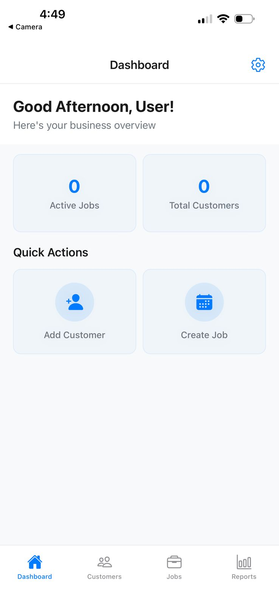

# Customer Management App

A mobile app for small business owners to manage customers, jobs, and reports — built with React Native and Expo.

## Screenshots



## Features

- **Dashboard** — overview of active jobs and total customers with quick-action shortcuts
- **Customers** — add, search, and view customer profiles with contact info and address
- **Jobs** — create and track jobs (Scheduled / In Progress / Completed), linked to customers with map location support
- **Reports** — create field reports with photos and descriptions
- **Bilingual** — full English and Portuguese (pt-BR) support, switchable in Settings
- **Offline-first** — all data stored locally via AsyncStorage, no backend required

## Tech Stack

- [Expo](https://expo.dev) ~54 with Expo Router (file-based navigation)
- React Native 0.81 / React 19
- TypeScript
- AsyncStorage for local persistence
- React Native Maps
- Expo Image Picker

## Getting Started

### Prerequisites

- Node.js 18+
- [Expo CLI](https://docs.expo.dev/get-started/installation/)
- iOS Simulator / Android Emulator, or the Expo Go app on a physical device

### Install

```bash
cd my-app
npm install
```

### Run

```bash
# Start the dev server
npm start

# Run on iOS simulator
npm run ios

# Run on Android emulator
npm run android

# Run in browser (limited functionality)
npm run web
```

## Project Structure

```
my-app/
├── app/
│   ├── (tabs)/          # All screens (tab bar + hidden detail screens)
│   │   ├── index.tsx        # Dashboard
│   │   ├── customers.tsx    # Customer list
│   │   ├── jobs.tsx         # Job list
│   │   ├── reports.tsx      # Reports list
│   │   ├── settings.tsx     # Settings (language, clear data)
│   │   └── ...              # Detail / add / edit screens
│   └── hooks/           # useJobs, useCustomers, useReports
├── components/          # Shared UI components
├── contexts/
│   └── LanguageContext.tsx  # i18n (en / pt)
└── assets/
```

## Data Storage

All data (customers, jobs, reports) is persisted locally with AsyncStorage under these keys:

| Key         | Contents             |
|-------------|----------------------|
| `customers` | Customer records     |
| `jobs`      | Job records          |
| `userName`  | Display name         |
| `language`  | `"en"` or `"pt"`     |

Data can be wiped from **Settings → Clear All Data**.
