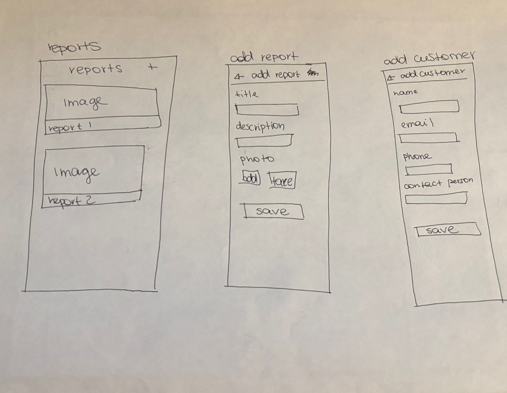

# iOS Customer Job Management App

A React Native mobile application for managing customers and jobs.

## Human Interface Guidelines Implementation

### Tab Bar Navigation

the app uses a standard ios tab bar at the bottom with 60pt height and 4 tabs (dashboard, customers, reports, jobs) to avoid overflow tabs that hig warns make content harder to reach. each tab has a 24pt icon with a 10pt label below it. active tabs are ios blue (#007AFF) and inactive tabs are gray (#8E8E93). following hig, no tabs are disabled, the jobs tab shows a placeholder explaining it's under development instead of being hidden, keeping the interface stable and predictable.

### Text Field Design

all forms follow apple's text field guidelines with placeholder text that disappears when typing. fields are stacked vertically with 15-20pt spacing for a clean organized layout. the app shows appropriate keyboards for each field like email keyboard for emails, phone pad for phone numbers, default for text, which hig says reduces typing errors. all fields exceed the 44x44pt minimum touch target with extra padding.

## Features

- **Dashboard** - Business overview with active jobs and customer statistics
- **Customer Management** - Browse, search, and view detailed customer information
- **Real-time Search** - Filter customers as you type

## Screens

1. **Dashboard** - Main screen showing business metrics and quick actions
2. **Customers** - Searchable list of all customers
3. **Customer Details** - Detailed view of individual customer information

## External Packages Used

This project utilizes the following Expo packages:

- **`expo-blur`** - Creates blur effects on disabled navigation taabs (Jobs and Reports) to indicate features under development
- **`@expo/vector-icons`** - Provides icons throughout the application including navigation icons, contact icons, and action buttons
- **`expo-status-bar`** - Controls the appearance of the device status bar
- **`expo-haptics`** - Provides feedback on user interactions such as button presses and navigation actions

## Screenshots

