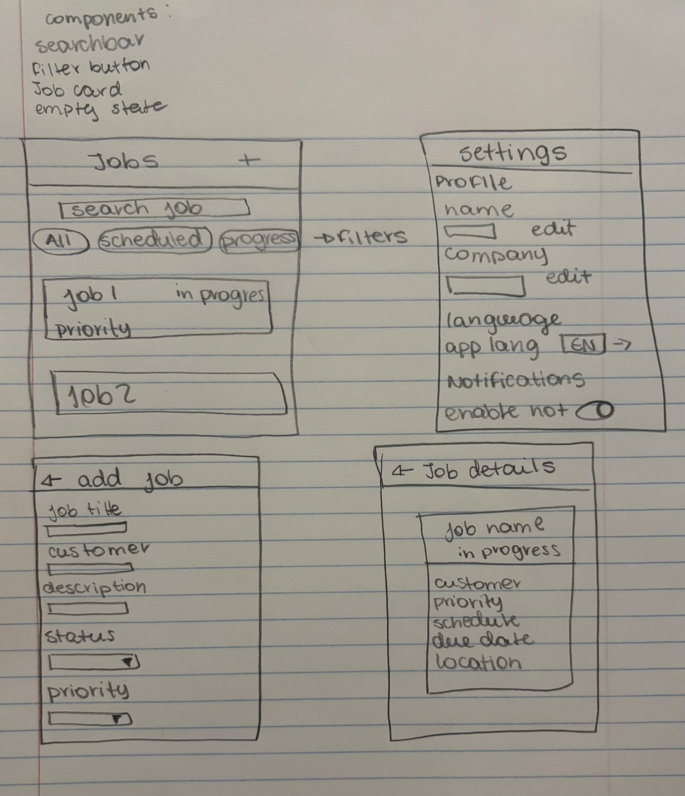

# iOS Customer Job Management App

A React Native mobile application for managing customers, jobs, and reports with bilingual support (English/Portuguese).

## What I have done

- Custom hooks for data management (useCustomers, useJobs, useReports)
- Customers linked to their jobs with full relational data
- Language translations (English/Portuguese) working across all screens
- Settings screen with profile editing, language toggle, data statistics, and clear data option
- Search and filtering functionality for customers and jobs
- Dashboard with live data counts for active jobs and total customers
- Maps integration with embedded MapView in Customer Details and Job Details
- Apple Maps directions button that opens navigation
- Forms with keyboard avoidance to prevent input fields from being covered
- Proper back button navigation throughout the app
- Haptic feedback on all interactions
- Modal pickers for selections (customer, status, priority)
- Date pickers for scheduling
- Camera and photo gallery integration for reports
- Form validation with required field checks

## Screens

1. **Dashboard** - Overview with active jobs count, total customers, and quick actions
2. **Customers** - List of all customers with search
3. **Customer Details** - Customer info with map and their jobs list
4. **Add Customer** - Form to create new customer
5. **Jobs** - List of all jobs with status filtering (All, Scheduled, In Progress, Completed)
6. **Job Details** - Job info with map and customer details
7. **Add Job** - Form to create new job
8. **Edit Job** - Form to edit existing job
9. **Reports** - List of all reports with photos
10. **Add Report** - Form to create report with camera/gallery
11. **Report Details** - View report with full photo
12. **Settings** - Profile, language, data stats, clear data

## External Packages Used

- **`@expo/vector-icons`** - App icons
- **`expo-status-bar`** - Status bar control
- **`expo-haptics`** - Tactile feedback
- **`@react-native-async-storage/async-storage`** - Local data storage
- **`react-native-maps`** - Map integration
- **`expo-router`** - Navigation
- **`expo-image-picker`** - Camera/photo access
- **`@react-native-community/datetimepicker`** - Date picker

## Human Interface Guidelines Implementation

### Tab Bar Navigation

The app uses a standard iOS tab bar at the bottom with 60pt height and 4 tabs (Dashboard, Customers, Jobs, Reports) to avoid overflow tabs that HIG warns make content harder to reach. Each tab has a 24pt icon with a 10pt label below it. Active tabs are iOS blue (#007AFF) and inactive tabs are gray (#8E8E93).

### Text Field Design

All forms follow Apple's text field guidelines with placeholder text that disappears when typing. Fields are stacked vertically with 15-20pt spacing for a clean organized layout. The app shows appropriate keyboards for each field like email keyboard for emails, phone pad for phone numbers, default for text, which HIG says reduces typing errors. All fields exceed the 44x44pt minimum touch target with extra padding.

### Color Usage

HIG says "avoid using the same color to mean different things" and to "use color consistently throughout your interface, especially when you use it to help communicate information like status or interactivity." In my app, I use iOS blue (#007AFF) consistently for all interactive elements like buttons and navigation so people recognize them as tappable. Red (#FF3B30) is used only for destructive actions like the delete button. All text uses primary color at 16pt and secondary at 14pt for proper hierarchy.

### Buttons and Touch Targets

HIG states "make buttons easy for people to use" and requires that "a button needs a hit region of at least 44x44 pt to ensure that people can select it easily." HIG also says to "ensure that each button clearly communicates its purpose." In my app, all buttons and interactive elements have a minimum size of 44x44pt to meet touch target requirements. Buttons use clear labels that start with action verbs like "Add Customer" or "Save Job" to communicate their purpose.

### Modals and Selection

HIG says to use "modals for focused tasks that require user input before continuing" and that "selected options show a checkmark" so users know their current selection. In my app, I use modals for selection tasks like choosing a customer, job status, or priority level. Each modal has a title at the top and a close button on the right. Selected items display a blue checkmark so users can see their current choice.

### Wireframes

