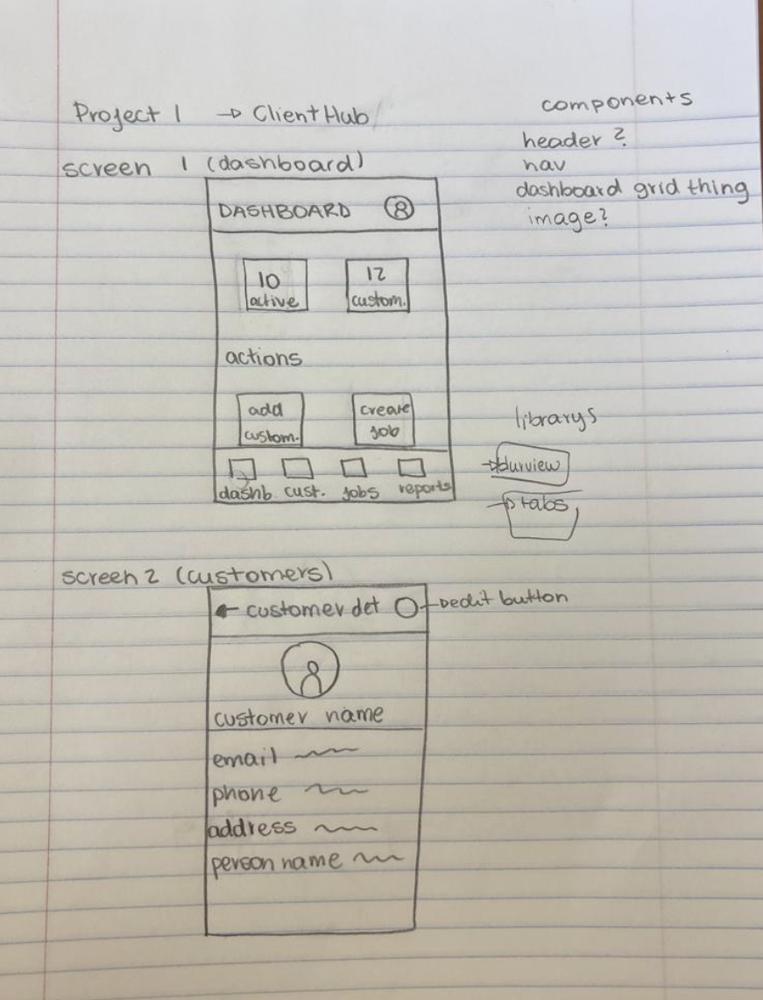

# iOS Customer Job Management App

A React Native mobile application for managing customers and jobs.

## Features

- **Dashboard** - Business overview with active jobs and customer statistics
- **Customer Management** - Browse, search, and view detailed customer information
- **Real-time Search** - Filter customers as you type

## Screens

1. **Dashboard** - Main screen showing business metrics and quick actions
2. **Customers** - Searchable list of all customers
3. **Customer Details** - Detailed view of individual customer information

## External Packages Used

This project utilizes the following Expo packages:

- **`expo-blur`** - Creates blur effects on disabled navigation tabs (Jobs and Reports) to indicate features under development
- **`@expo/vector-icons`** - Provides icons throughout the application including navigation icons, contact icons, and action buttons
- **`expo-status-bar`** - Controls the appearance of the device status bar
- **`expo-haptics`** - Provides feedback on user interactions such as button presses and navigation actions

## Screenshots

